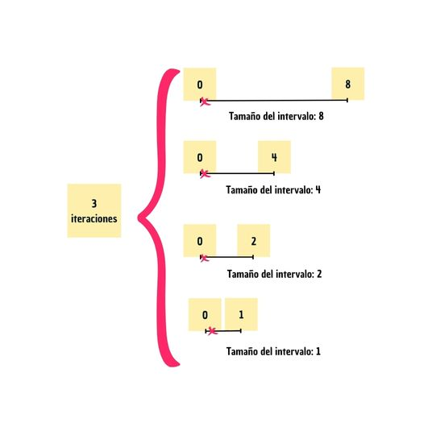
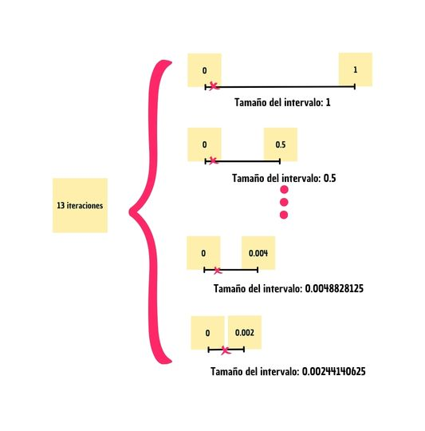
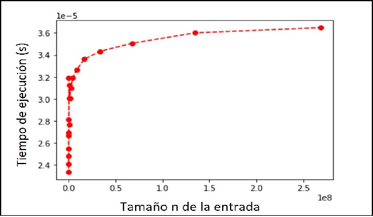
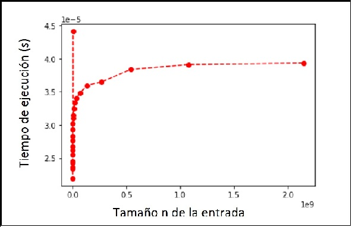

# Bisección - Taller 1 - Grupo 6

Este algoritmo implementa la búsqueda de raíces por bisección, teniendo como tolerancia para determinar la precisión de la raíz un valor &epsilon; = 0.0001

## Autores
 -  Cabrales Jaque, Maria Fernanda
 - Monroy Molina,  Diana Valentina
 - Pardo Machett's, Nicolás Felipe
 - Peñafiel Ojeda, Juan Sebastián
 - Tocua Perilla, Daniela

## Complejidad del algoritmo
Para n = abs(b-a), es decir, el tamaño del intervalo, la complejidad viene dada de la siguiente manera.

    def  bisection(a,b):                # O(log(n))  + 4* O(1) =  O(log(n)) + O(1)  = O(log(n))
	    f_a = function(a)               # O(1)
	    f_b = function(b)               # O(1)
	    c = (b+a)/2                     # O(1)
	    f_c = function(c)               # O(1)
	    if f_a * f_b < 0:               # O(log(n))  (peor caso)
		    while  abs(f_c) >= 0.0001:  # O(log(n)) * (4 * O(1)) = O(log(n)) * (O(1)) =  O(log(n)) -- ver detalles
			    c = (b+a)/2             # O(1)
			    f_c = function(c)       # O(1)
			    if f_c * f_a < 0:       # O(1) 
				    b = c               # O(1)
				elif f_c * f_b < 0:     # O(1)
				    a = c               # O(1)
				else:                   # O(1)
					return c            # O(1)
				return c                # O(1)
		elif f_a * f_b > 0:             # O(1)
			return  "Not certain"       # O(1)
		else:                           # O(1)
			if f_a == 0:                # O(1)
				return a                # O(1)
			else:                       # O(1)
				return b                # O(1)

### Detalles
**¿Por qué O(log(n))?**

Este es un algoritmo del tipo *Divide y vencerás*. En este caso dividimos el problema (dónde está la raíz en un intervalo de tamaño n) a un subproblema de menor tamaño (dónde está la raíz en un intervalo de tamaño n/2) , descartando la mitad del intervalo.

A continuación, un pequeño ejemplo:

Para la función 2x - 0.0002 se tiene la raíz x = 0.0001. 
Si tenemos el intervalo [0,8]:

Hasta el momento, se han tenido tenido que hacer O(log(n)) => log(8) = 3  iteraciones del ciclo while. Pero se requiere cumplir con la precisión dada. (epsilon; = 0.0001)

Esto último requiere O(log(&epsilon;)) => - log(0.0001)) = 13 iteraciones. Como nuestra precisión es constante, esto será O(1).

La precisión entonces de nuestro ciclo while es de: 

> O(log(n)) + O(1) = O(log(n))

### Gráficas
A continuación podemos ver algunas gráficas *n vs tiempo de ejecución*

Estas gráficas describen un comportamiento logarítmico del tiempo de ejecución con respecto a los tamaños de entrada n. 
